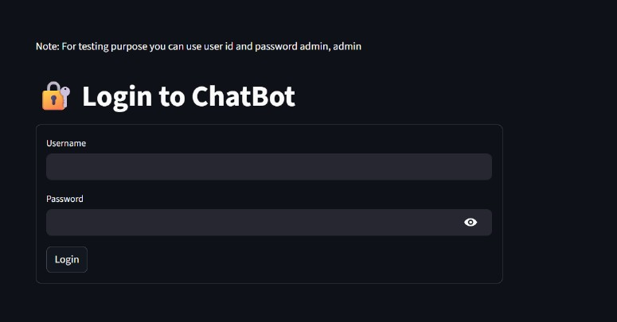
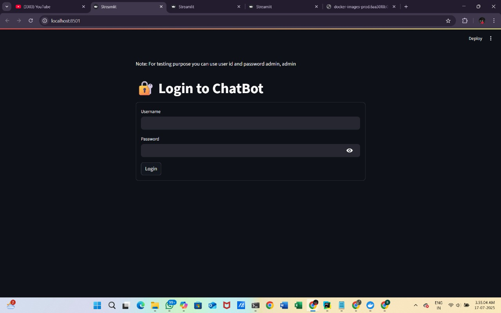
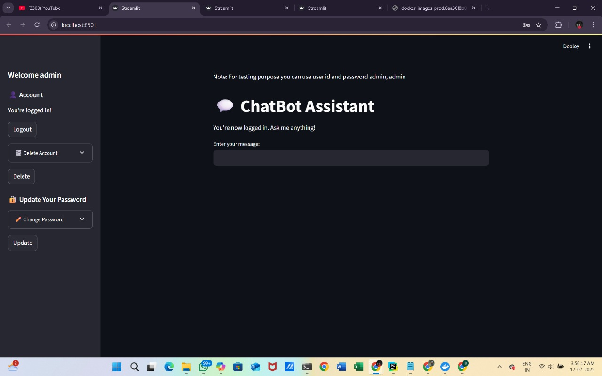
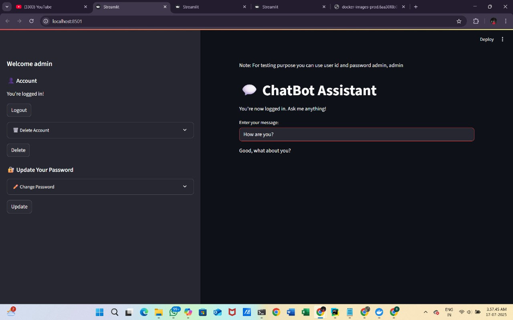

# 🤖 General Chatbot Model (v1)

A basic AI-powered chatbot built using **PyTorch**, **NLTK**, and **Streamlit**. This chatbot can classify user intent from a small dataset and respond accordingly in English and Hindi. It also includes basic user authentication.

---

## 🔧 Features

- ✅ **Intent Classification** using NLP (BoW, Lemmatization)
- ✅ **Custom PyTorch Model** trained on your own `intents.json`
- ✅ **Streamlit Frontend** with login/logout system
- ✅ **Multilingual Support** (English + Hindi)
- ⚠️ **Basic Authentication** system (login works, delete/update pending)
- 🚀 Easy to extend and modular design

---

## 🛠️ How to Run

### 1. Install Requirements
```bash
pip install -r requirements.txt

### 2. Run APP
streamlit run app.py

## 🔐 Login Credentials (for Testing)

> Use the following login details to test the chatbot:

| Username | Password |
|----------|----------|
| `admin`  | `admin`  |
| `bablu`  | `bablu`  |
| `rahul`  | `rahul`  |

⚠️ Note:
- These credentials are **hardcoded** and used only for testing purposes in version 1.
- Do **not** use this method for real authentication. In future versions, authentication will be securely handled using external files or databases.


## 🧪 Testing the Chatbot

You can try these sample inputs after login:

- `Hi` → "Hello! How can I help?"
- `What is programming?` → "Programming means writing code..."
- `Aapko kisne banaya?` → "Mujhe Bablu Kumar Jha ne banaya hai."

You can also enter `/quit` to exit the chatbot.

###  App preview
## 📸 App Preview



[](https://github.com/BabluKumarJha/General_chatbot_model_v1/blob/edd94616927afa7f08df262b33a882fa6585f1ff/screenshot/1e9ac0568b4d47b287b8ae21973a2377.jpg)



### Folder structures

| File / Folder       | Description                                       |
| ------------------- | ------------------------------------------------- |
| `app.py`            | Streamlit-based UI and interaction logic          |
| `main.py`           | Model training script using PyTorch               |
| `intents.json`      | Intent tags, patterns, and responses              |
| `dimensions.json`   | Input/output size configuration for model         |
| `chatbot_model.pth` | Trained PyTorch model weights                     |
| `requirements.txt`  | Python package dependencies                       |
| `.gitignore`        | Ignore unnecessary files like `.venv`, cache etc. |


## 🔄 Future Roadmap (v2 & Beyond)

- ✅ Fix delete & password update functionality
- ✅ Store user credentials externally (JSON or MongoDB)
- ✅ Implement context-aware conversation
- ✅ Enable chat history logging and export
- ✅ Add more training data for better NLP accuracy
- ✅ Integrate Docker/Streamlit Cloud deployment
- ✅ Add API endpoints for external integrations
- ✅ Full Hindi/Maithili language model support

## 🧠 Learning Focus

This project is part of my self-driven AI/ML learning journey, where I implemented:
- NLP Preprocessing (Tokenization, Lemmatization)
- Bag of Words (BoW) Vectorization
- PyTorch Model (Training & Inference)
- Model Saving & Loading
- Streamlit Interface
- Simple Session Management & User Handling

Even though some code parts are adapted, the logic, model, training, and structure were custom-designed and written by me.


## 🙌 Contributions

Feel free to fork this repo and improve it.

### You can contribute:
- Adding new intents/responses
- Improving model training and accuracy
- Enhancing UI with chat-style interface
- Securing authentication
- Translating into more languages

Please submit a Pull Request with proper description.


## 👨‍💻 Developer Info

**Bablu Kumar Jha**  
_Data Scientist & AI Enthusiast_  

- 📌 GitHub: [@BabluKumarJha](https://github.com/BabluKumarJha)  
- 📸 Instagram: [@jhabablu62](https://instagram.com/jhabablu62)  
- 💬 Languages: English, Hindi, Maithili  
- 🛠️ Tech Stack: Python, PyTorch, Streamlit, Json, Docker, NLP  
- 🎯 Career Goal: To become a production-ready Data Scientist & AI Developer

> This project is part of my self-learning journey and showcases my ability to integrate ML, UI, and backend logic from scratch.
